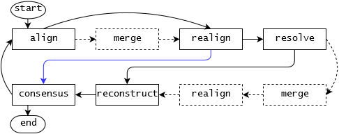

# Pan-genome construction


## Prerequisites
This program was implemented in Python and requires Python3.4 or higher.

It depends on the following Biopython modules: SeqIO, Seq, SeqRecord and pairwise2.  
  
  
Software required for running pipeline for set of genomes
* snakemake
* progressiveMauve
* Java8

---
## Program
### Usage
```
seqseqpan.py  [-h] [-x XMFA_F] -p OUTPUT_P -n OUTPUT_NAME
                [-c CONSENSUS_F] [-m] [-o ORDER]
                {consensus,resolve,realign,xmfa,maf,map,merge,separate,remove,split,extract}
                [-i COORD_F] [-l LCB_LENGTH] [-r RM_GENOME]
                [-g GENOME_DESC_F] [-e REGION] 
                

  -h, --help            show this help message and exit
  
  -x XMFA_F, --xmfa XMFA_F
                        XMFA input file
  
  -p OUTPUT_P, --output_path OUTPUT_P
                        path to output directory
  
  -n OUTPUT_NAME, --name OUTPUT_NAME
                        file prefix and sequence header for consensus FASTA /XFMA file
  
  -c CONSENSUS_F, --consensus CONSENSUS_F
                        consensus FASTA file used in XMFA
  
  -m, --merge           Merge small blocks to previous or next block in resolve-step.
  
  -o ORDER, --order ORDER
                        ordering of output (0,1,2,...) [default: 0]
  
  -t {consensus,resolve,realign,xmfa,maf,map,merge,separate,remove,split,extract}, --task {consensus,resolve,realign,xmfa,maf,map,merge,separate,remove,split,extract}
                        what to do (consensus|resolve|realign|xmfa|map|merge|separate|maf|remove|split|extract)

  -i COORD_F, --index COORD_F
                        file with indices to map. First line: source_seq dest_seq[,dest_seq2,...] using "c" or sequence number.
                        Then one coordinate per line. Coordinates are 1-based!
  
  -l LCB_LENGTH, --length LCB_LENGTH
                        Shorter LCBs will be separated to form genome specific entries.
  
  -r RM_GENOME, --removegenome RM_GENOME
                        Number of genome to remove (as shown in XMFA header)
  
  -g GENOME_DESC_F, --genome_desc GENOME_DESC_F
                        File containing genome description (name/chromosomes) for .MAF file creation and 'split' task. 
                        Format: genome number as in xmfa      name/description      length    (separated with tabs)
                        Length information is only necessary for FASTA files containing more than one chromosome. 
                        Multiple chromosomes a genome must be listed in the same order as in original FASTA file.
                        
  -e REGION, --extractregion REGION
                        Region to extract in the form genome_nr:start-end (one based and inclusive) or only genome_nr for full sequence.

```

#### Tasks
Choose task with argument **-t**. Arguments **-p** and **-n** are required for every task.

| task    |description|output|arguments|optional arguments|
|---------|-----------|------|---------|------------------|
|consensus|Create consensus sequence from XMFA file.|2 .FASTA files (with delimiter and without) and 2 .IDX files |-x |-o|
|extract  |Extract sequence for whole genome or genomic interval|.FASTA file|-x, -e||
|maf      |Write MAF file from XMFA file.|.MAF file|-x, -g||
|map      |Map positions/coordinates from consensus to sequences, between sequences, ...|.TXT file|-i, -c||
|merge    |Add small LCBs to end or beginning of surrounding LCBs. Stand-alone merging step can only be used with two aligned sequences. |.XMFA file|-x|-o|
|realign  |Realign sequences of LCBs around consecutive gaps, only possible before resolve-step.|.XMFA file|-x|-o|
|remove   |Remove a genome from all LCBs in alignment.|.XMFA file|-x, -r|-o|
|resolve  |Build alignment of all genomes from .XMFA file with new genome aligned to consensus sequence.|.XMFA file|-x, -c|-m, -o|
|separate |Separate small LCBs to form genome specific entries.|.XMFA file|-x, -l|-o|
|split    |Split LCBs according to chromosome annotation.|.XMFA file|-x, -g|-o|
|xmfa     |Write XMFA file from XMFA file.|.XMFA file|-x|-o|

---

## Additional scripts
### Genome Description File 
Use the genome_description.py script to generate the genome description file for a set of .FASTA files.
```
python3.4 genomedescription.py -i GENOME_LIST -o GENOME_DESC_F
```

## Pipeline
### Usage
#### Build pan-genome from set of sequences
```
snakemake --snakefile run_seqseqpan.Snakemake --config genomefile=genome_list.txt outfilename=TB_example merge=True
```

#### Add set of sequences to existing pan-genome
```
snakemake --snakefile run_seqseqpan.Snakemake --config genomefile=genome_list_new.txt outfilename=TB_example_extended merge=True pangenome=TB_example.xmfa
```

#### Config

| name        | description |
|-------------|-------------|
| genomefile  |One line per genome with full path to .FASTA file. |
| outfilename |Prefix for all final output files.|
| merge       |Optional, default = True. Do you want to include the merging steps?|
| pangenome   |Path to exisiting pan-genome (pangenome.XMFA). Accompanying genome description file has to be present in same folder (pangenome_genomedescription.TXT).|

---

#### Representation of pipeline

Pipeline steps are represented as blocks, dashed ones are optional. The first iteration is different and is marked with the blue arrow.




## Pan-genome data structure
For full representation of pan-genome and to be able to work with the data structure, only the .XMFA and the genome_description files are needed.

.FASTA files can be discarded as all sequences can be extracted from the pan-genome, the consensus sequence can be constructed from the .XMFA file at any time.